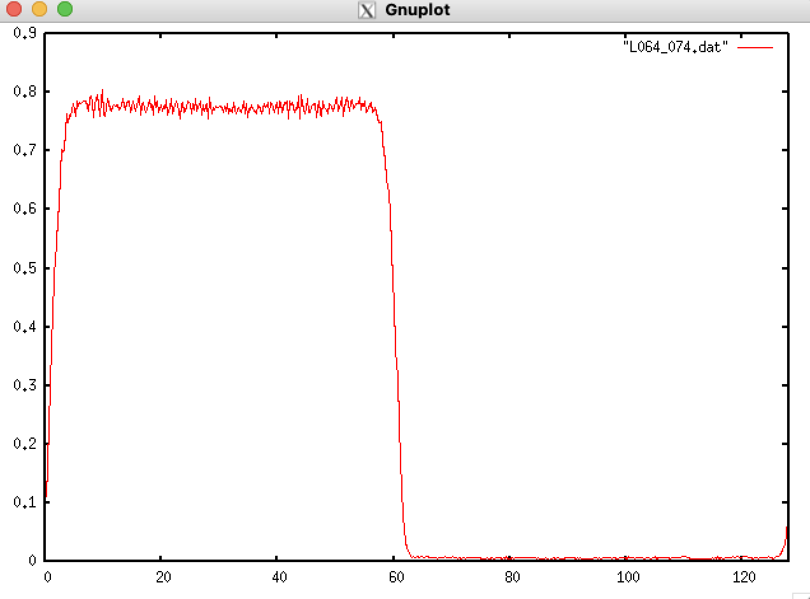

# MDACP Ver 1.0

## 概要

古い並列MDコード。コードのサルベージのためにアップロード。メンテはされない。

## 気液共存状態の実現

研究室サーバにてclone。makeでビルドできるはず。

```sh
git clone https://github.com/kaityo256/mdacpv1.git
cd mdacpv1
make
```

`go.sh`があるので、それを投入する。

```sh
qsub go.sh
```

2分弱で実行が終わり、`L064_074.dat`が生成されるはず。これをgnuplotで表示するとこんな感じになる。

```txt
gnuplot> p [0:128] "L064_074.dat" w l
```



## 解説

### シミュレーションとして何をしているか

(x,y,z) = 64x64x128の直方体のシミュレーションボックスを作り、z＜64を液相、z＞64を気相の予想密度で初期状態をFCCで用意しておく。そのまま温度(T=0.74)である程度緩和させ、その後、z方向にビンに切って平均、密度のz依存性を出力している。共存相になっていれば、z=64付近で密度がtanh型になる(液相から気相に、なめらかに密度が変化する)。

### どのように実行されているか

ビルドしたコードには、インプットファイルとして`cfg`ファイルを食わせている。インプットファイル`L064_074.cfg`の中身は以下の通り。

```txt
Mode=ChemiPote
InitialVelocity=1.8
TimeStep=0.005
SystemSizeX=64
SystemSizeY=64
SystemSizeZ=128
GridX=5
GridY=4
GridZ=1
#ThermalizeLoop=4000000
ThermalizeLoop=4000
#TotalLoop=1000000
TotalLoop=1000
ObserveLoop=100
HeatbathTau=0.1
HeatbathGamma=0.5
HeatbathType=NoseHoover
Thermalize=yes
Observe=yes
LiquidDensity=0.769669
GasDensity=0.00994751
FileName=L064_074.dat
OutputFile=L064_074.out
DumpFile=L642_074.dmp
AimedTemperature=0.74
```

このcfgファイルには`Mode`という項目があり、これにより実行されるコードが変化する。`Mode=ChemiPote`の場合は、`chemipote.cc`の中の`ChemiPote::Run`が実行される。

この中で、`GridX`,`GridY`,`GridZ`は、並列計算する際に系をどのように分割するかを決める。いまはZ方向に非一様なので、X方向に5分割、Y方向に4分割の20並列で実行している。

`ThermalizeLoop=4000`は緩和のステップ数。テストのために少なくしているが、このステップでは全然少ない。`4000000`くらいは必要だと思われる。

また、観測ループ数は`TotalLoop`で与えているが、これも`1000000`くらいは必要ではないかと思われる。

液相密度と気相密度は`LiquidDensity=0.769669`、`GasDensity=0.00994751`で与えている。これは小さい系でだいたい「あたり」をつけた初期値。

系の半分に液相、気相の密度を生成しているコードは`ChemiPote::MakeConfHalfFCC`という関数。ここで気相、液相密度をもらって、それぞれ半分ずつFCCに格子を組んでいる。
